# STM32 based LoRa spectrum analyzer & pager

<!-- 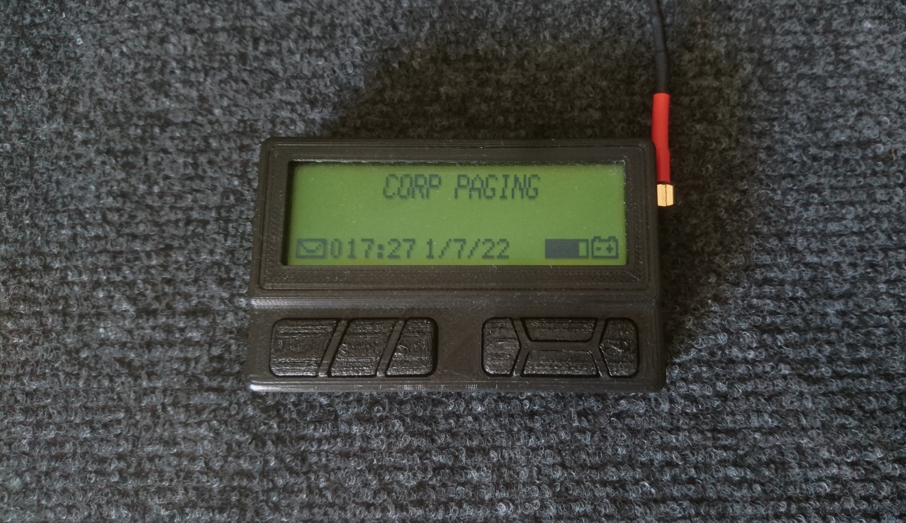 -->

## Features

 - Sending and receiving messages through LoRa
 
 - Configuring most of the RFM95's settings
 
 - Spectrum analyzer
 
 - Direct view of RFM95's registers
 
 - Battery measurement
 
 - Backlight
 
 - Vibration
 
 - Sleep modes
 
## Menu description

### *All 10 menus (with the last one being an optional clock)*
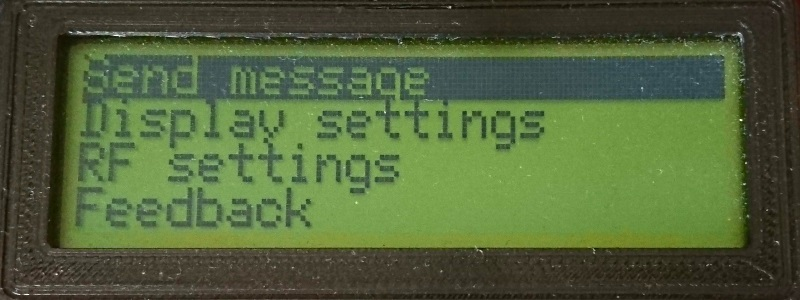 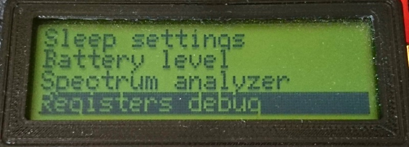 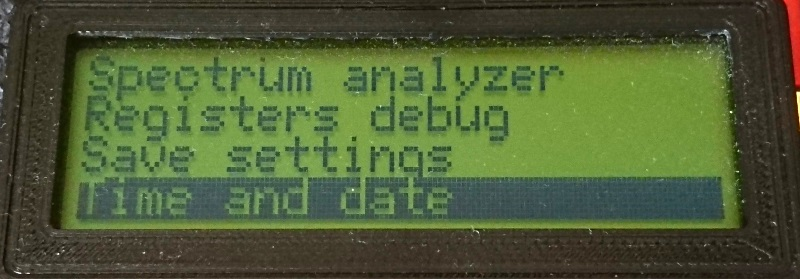  
 
### *Send message*
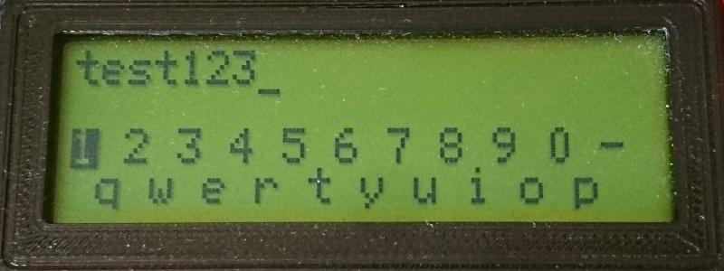

 - Screen is split into two halves
   - Text field
   - Scrollable keyboard with SEND / CLEAR / BACKSPACE buttons at the bottom

### *Display settings*
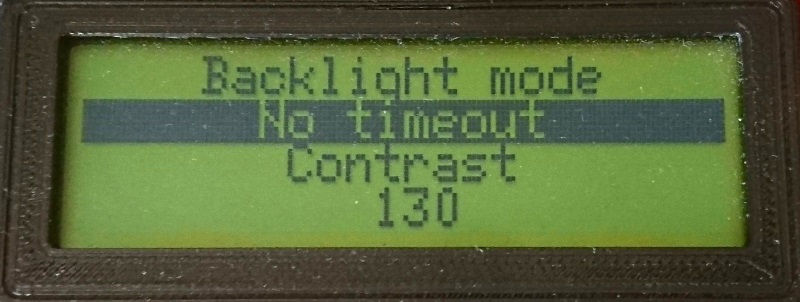

 - Backlight mode - timeout / no timeout (will not go to sleep) / on startup (turn backlight on when starting up)
 - Adjust contrast

### *RFM95 settings*
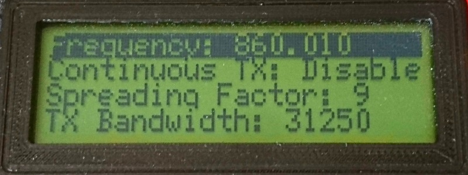 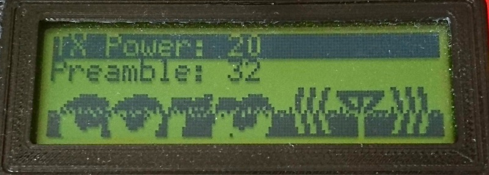

 - Setting frequency
   - Select a digit to change by entering in option and moving the digit cursor left / right
 - Continuous TX - doesnt transmit actual data, used for testing other devices

### *Feedback*
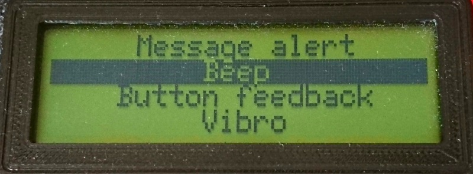

 - Select ringing type when a message is received - silent / single beep / beep & vibration / only vibration
 - Select key press feedback - silent / only click / click & vibration / only vibration

### *Sleep settings*

 - Enable / disable sleep
 - Enable / disable receiving (when enabled, device wakes up every 5 seconds to listen for a incoming message)

### *Battery level*
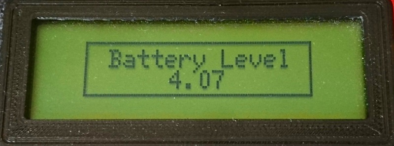

 - Shows battery level in volts

### *Spectrum analyzer*
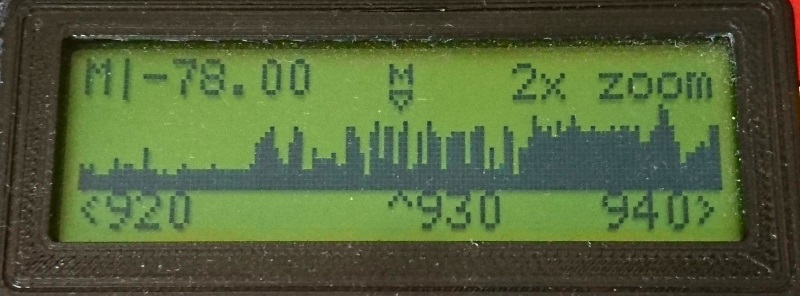

 - Marker indicates RSSI for center frequency
 - 4 levels of vertical zooming
 - Navigation through parameters is done by pressing enter
 - Editing starting and ending frequency of the window
   - Up / down adjusts frequency by 1
   - Left / right adjusts frequency by 5
 - Showing parameters and/or marker is done by pressing multi key
